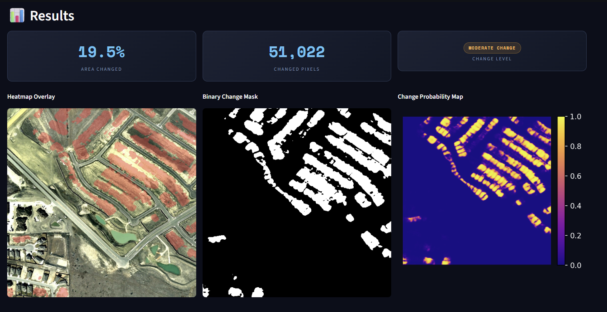
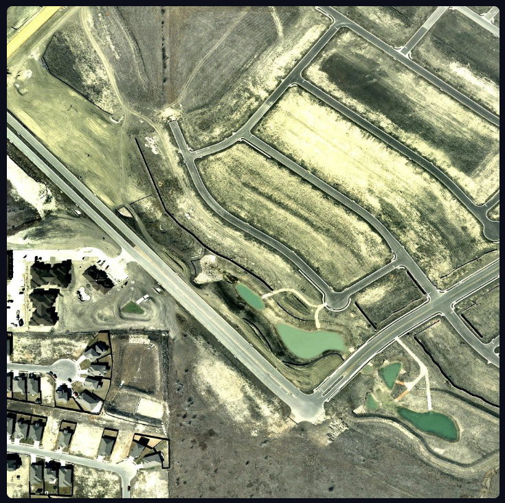
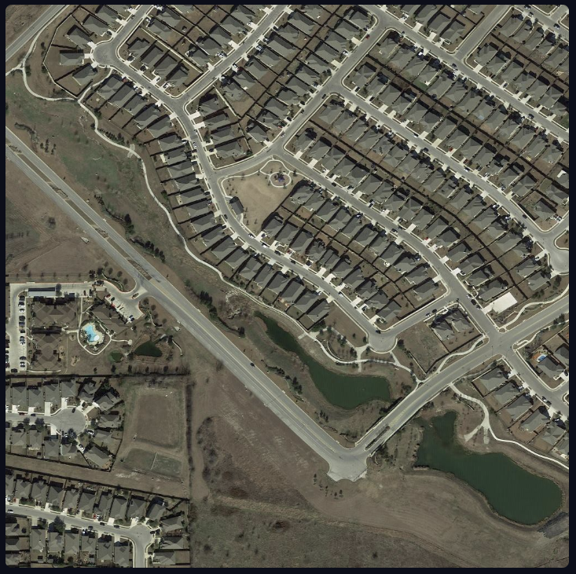
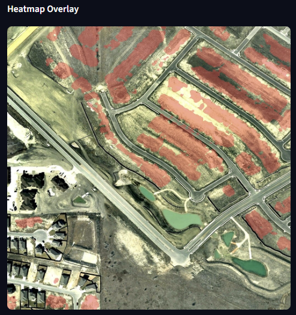

# 🛰️ Satellite Change Detector

> Deep learning model that detects and quantifies surface changes between before/after satellite image pairs — deployed as a live interactive web app.

**[🚀 Live Demo](https://huggingface.co/spaces/HirbodJB/satellite-change-detector)** · **[💻 GitHub](https://github.com/HirbodJB/satellite-change-detector)**

---


*Left: Heatmap overlay highlighting detected changes in red. Center: Binary change mask. Right: Per-pixel change probability map.*

---

## What It Does

Upload two satellite images of the same location taken at different times. The model analyzes every pixel and produces:

- **Heatmap overlay** — red highlights painted directly on the before image
- **Binary change mask** — precise pixel-level map of what changed
- **Change probability map** — per-pixel model confidence from 0.0 to 1.0
- **Change percentage** — quantified area changed as a metric

Real-world applications include monitoring deforestation, tracking urban expansion, detecting flood or disaster damage, and measuring construction growth over time.

---

## Demo

| Before | After | Detected Changes |
|--------|-------|-----------------|
|  |  |  |

*Example: Entire residential neighborhood constructed between image captures. Model correctly identifies new building footprints across the scene.*

---

## Results

Trained on a combined dataset of **[LEVIR-CD](https://justchenhao.github.io/LEVIR/)** and **[LEVIR-CD+](https://github.com/S2Looking/Dataset)** — 1,083 high-resolution (1024×1024, 0.5m/pixel) Google Earth image pairs spanning 5–18 years of urban change across Texas.

| Metric | Score |
|--------|-------|
| **IoU (Jaccard Index)** | **0.6959** |
| **F1 Score** | **0.7902** |
| **Training Pairs** | 1,083 (LEVIR-CD + LEVIR-CD+) |
| **Test Set** | LEVIR-CD official test split (128 pairs) |

---

## Architecture

```
Before image (3ch) ──┐
                      ├──► Concatenate (6ch) ──► ResNet-34 Encoder (pretrained ImageNet)
After  image (3ch) ──┘                                      │
                                               5 feature scales extracted
                                                             │
                                          U-Net Decoder (skip connections)
                                                             │
                                          1-channel sigmoid output
                                          (per-pixel change probability)
```

**Design decisions:**
- **Siamese design** — both images share the same encoder weights, so the model learns to compare rather than memorize individual scenes
- **Pretrained ResNet-34 encoder** — transfer learning from 1.2M ImageNet photos means strong visual understanding from epoch 1
- **U-Net decoder with skip connections** — preserves fine spatial detail that gets lost during encoding, critical for pixel-precise masks
- **BCE + Dice loss** — BCE handles per-pixel accuracy while Dice handles the class imbalance problem (most pixels don't change)
- **Test Time Augmentation (TTA)** — at inference, predictions are averaged across 4 flipped versions of each image pair for more robust results

**Training config:**
- Encoder: ResNet-34 (ImageNet pretrained)
- Loss: 0.5 × BCEWithLogits + 0.5 × Dice
- Optimizer: AdamW (lr=1e-4, weight_decay=1e-4)
- Scheduler: Cosine Annealing
- Epochs: 100 · Batch size: 8 · Image size: 256×256
- Hardware: RTX 5070 Ti (~25 min)

---

## Run Locally

**1. Clone and install:**
```bash
git clone https://github.com/HirbodJB/satellite-change-detector
cd satellite-change-detector

python -m venv venv
venv\Scripts\activate          # Windows
# source venv/bin/activate     # Mac/Linux

pip install -r requirements.txt
```

**2. Download the dataset:**

Go to [LEVIR-CD](https://justchenhao.github.io/LEVIR/) → Google Drive → download `train.zip`, `val.zip`, `test.zip` and unzip into:

```
data/raw/
    train/A/    train/B/    train/label/
    val/A/      val/B/      val/label/
    test/A/     test/B/     test/label/
```

Optionally download [LEVIR-CD+](https://drive.google.com/file/d/1JamSsxiytXdzAIk6VDVWfc-OsX-81U81) and place at:
```
data/raw/levir_plus/LEVIR-CD+/
    train/A/    train/B/    train/label/
    test/A/     test/B/     test/label/
```

**3. Train:**
```bash
python src/train.py --epochs 100 --lr 1e-4 --img_size 256 --batch_size 8 --encoder resnet34
```

**4. Run the app:**
```bash
streamlit run app/app.py
```

Opens at `http://localhost:8501` — upload a before and after image, hit Detect Changes.

---

## Project Structure

```
satellite-change-detector/
├── src/
│   ├── dataset.py       ← LEVIR-CD + LEVIR-CD+ dataloader + augmentations
│   ├── model.py         ← Siamese U-Net + DiceBCE loss
│   ├── metrics.py       ← IoU, F1, Precision, Recall
│   ├── train.py         ← Training loop with checkpointing
│   └── inference.py     ← Predictor class with TTA support
├── app/
│   └── app.py           ← Streamlit UI
├── assets/              ← README screenshots
├── data/raw/            ← Dataset goes here (not tracked by git)
├── models/              ← Saved checkpoints (not tracked by git)
└── requirements.txt
```

---

## Stack

`PyTorch` · `segmentation-models-pytorch` · `OpenCV` · `Albumentations` · `Streamlit` · `Hugging Face Spaces`

---

## Troubleshooting

| Problem | Fix |
|---------|-----|
| `CUDA out of memory` | Reduce `--batch_size` to 4 |
| `ModuleNotFoundError` | Activate venv and run `pip install -r requirements.txt` |
| App shows "Model not found" | Check sidebar model path matches where `best_model.pth` is saved |
| Low IoU after training | Try `--lr 3e-4` and `--epochs 80`; verify mask pixel values are 0/255 |

---

## License

MIT — built by [Hirbod Jabbarnezhad](https://github.com/HirbodJB)
